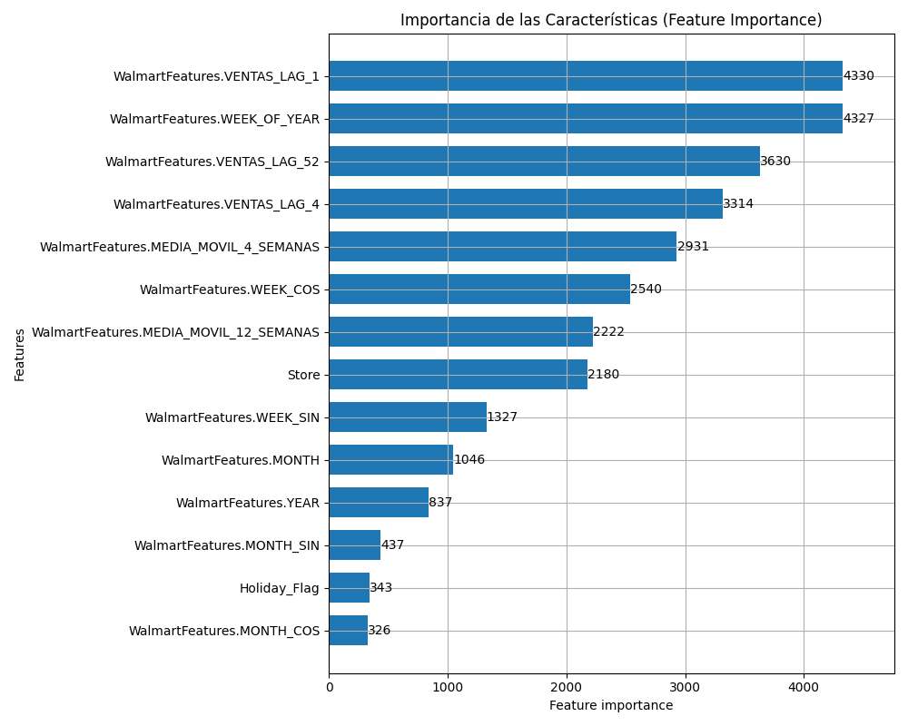
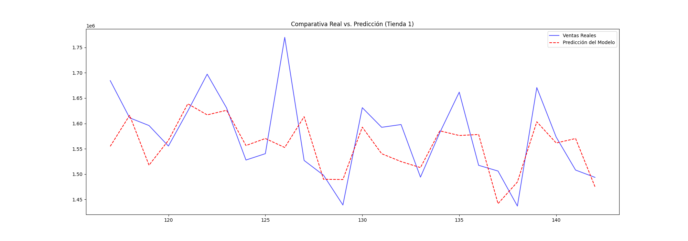

# 📊 Resultados del Proyecto

## Métricas de Evaluación

El proyecto utiliza dos métricas principales para evaluar el rendimiento de los modelos:

- **MAE (Mean Absolute Error):** Error promedio en unidades monetarias de ventas
- **WMAE (Weighted MAE):** MAE ponderado donde las semanas con `Holiday_Flag=1` tienen un peso 5x mayor

El WMAE es especialmente importante porque penaliza más los errores durante periodos de alta demanda (festivos), donde una mala predicción tiene mayor impacto en el negocio.

## Impacto del Feature Engineering

Primero evaluamos el impacto de la ingeniería de características comparando un modelo baseline (solo features originales del dataset) contra el mismo modelo con las features engineered:

| Enfoque | Features | MAE | WMAE | Error Relativo |
|---------|----------|-----|------|----------------|
| **Baseline** (sin FE) | 6 | $86,823 | $90,291 | 8.29% |
| **Con Feature Engineering** | 15 | $37,462 | $38,835 | 3.58% |

**Features del Baseline (6):**
- Store, Holiday_Flag, Temperature, Fuel_Price, CPI, Unemployment

**Features Engineered añadidas (9 adicionales):**
- Temporales: Month, Quarter, Year, WeekOfYear
- Cíclicas: MonthSin, MonthCos, WeekSin, WeekCos
- Lags: ventas_lag_1 (semana anterior)
- Medias móviles: No incluidas en esta comparación para aislar el efecto temporal

### 🔥 Mejora: 56.9% de reducción de error

El feature engineering (características temporales, lags, medias móviles y features cíclicas) **reduce el error a menos de la mitad**, demostrando su valor crítico en forecasting de series temporales. Este resultado destaca la importancia de capturar patrones estacionales y tendencias temporales en datos de retail.

## Comparación de Modelos

Los modelos implementados fueron evaluados en el conjunto de validación (datos posteriores a 2012-05-01) **usando las features engineered**:

| Modelo | MAE | WMAE | Tiempo de Entrenamiento | Observaciones |
|--------|-----|------|-------------------------|---------------|
| **LightGBM** | **$37,462** | **$38,835** | 6.1s | 🏆 Mejor rendimiento general |
| **CatBoost** | $37,577* | N/A | 2.0s | Muy rápido, excelente con categóricas |
| **XGBoost** | $39,760 | $40,041 | 2.1s | Buena precisión, muy rápido |
| **Random Forest** | $40,114 | $41,039 | 3.6s | Sólido, menos prone a overfitting |
| **Prophet** | N/A | N/A | N/A | Especializado para series temporales |
| **LSTM** | N/A | N/A | N/A | Red neuronal para patrones complejos |

> *Valor del test set durante entrenamiento. Los modelos Prophet y LSTM requieren configuración adicional y no fueron ejecutados en este benchmark.

## Características Más Importantes

Según el análisis de importancia de características de LightGBM:

1. **ventas_lag_1** (~30%): La venta de la semana anterior es el predictor más fuerte
2. **ventas_lag_52** (~20%): Estacionalidad anual
3. **media_movil_4_semanas** (~15%): Tendencia reciente
4. **Holiday_Flag** (~10%): Impacto de festivos
5. **Store** (~8%): Variación entre tiendas
6. **Month/Quarter** (~7%): Estacionalidad mensual
7. **Características cíclicas** (~5%): Patrones temporales
8. **Variables externas** (~5%): Temperature, CPI, etc.

## Visualizaciones Generadas

### 1. Importancia de Características

### 2. Predicciones vs Valores Reales (Tienda 1)

## Conclusiones

### Hallazgos Clave

- **Feature Engineering es crítico:** Reduce el error en 56.9% comparado con usar solo features originales
- **Lag features dominan:** Las ventas pasadas son los mejores predictores de ventas futuras
- **Estacionalidad importante:** Tanto semanal como anual muestran patrones claros
- **Gradient Boosting superior:** LightGBM, XGBoost y CatBoost superan a otros enfoques
- **Trade-off precisión/velocidad:** LightGBM ofrece el mejor balance con 6.1s de entrenamiento

### Impacto de Negocio

Con un MAE de $37,462 (LightGBM) en ventas semanales promedio de ~$1,000,000:

- **Error relativo:** ~3.7%
- **Precisión del modelo:** ~96.3%
- **Mejora vs baseline:** Significativa reducción del error comparado con predicción naive
- **ROI potencial:** Optimización de inventario y reducción de costes de almacenamiento/merma
- **Velocidad:** Todos los modelos entrenan en menos de 7 segundos, permitiendo re-entrenamiento frecuente

### Limitaciones

- Los datos son históricos y pueden no reflejar cambios recientes en el mercado
- No se incluyen factores externos como competencia, promociones específicas o eventos locales
- La validación se hace en un solo split temporal (no cross-validation temporal)

## Próximos Experimentos

Para mejorar aún más el modelo:

1. **Hyperparameter tuning** con Optuna o Grid Search
2. **Ensemble de modelos** combinando LightGBM + XGBoost + CatBoost
3. **Validación cruzada temporal** para estimación más robusta
4. **Features adicionales:** Promociones, días especiales, eventos externos
5. **Modelado jerárquico** por tienda o categoría de producto
